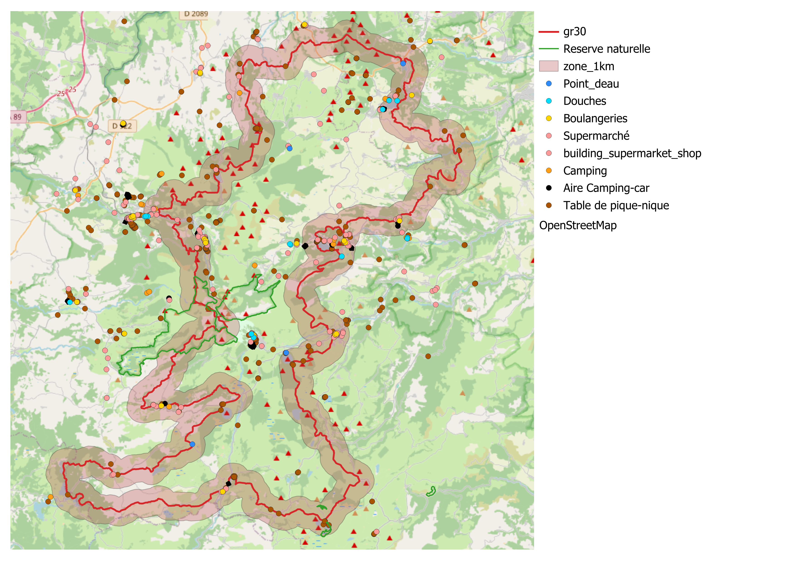
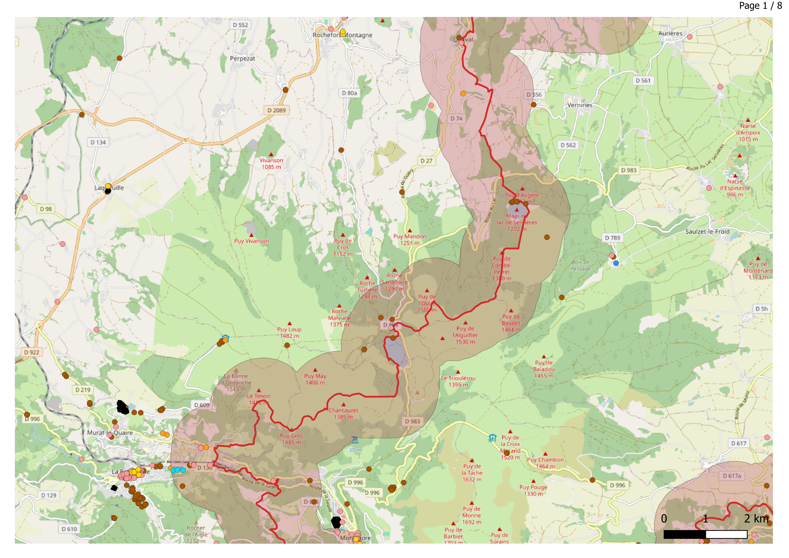
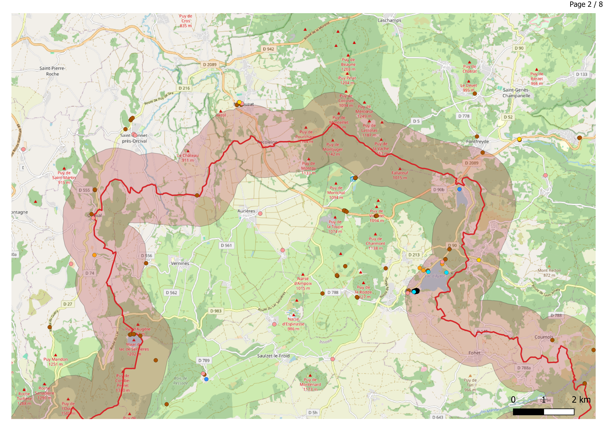
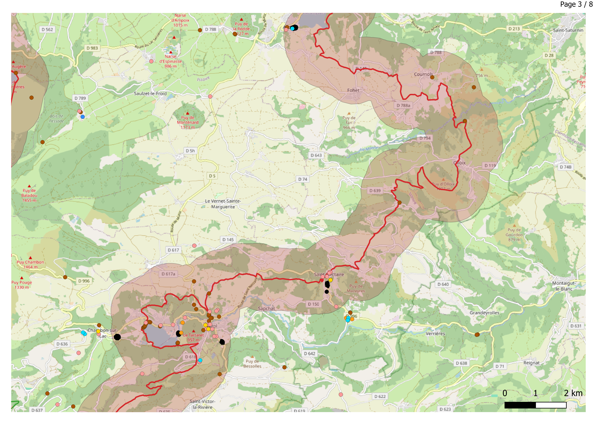
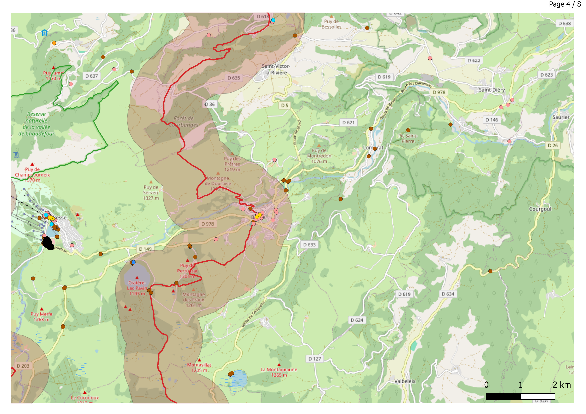
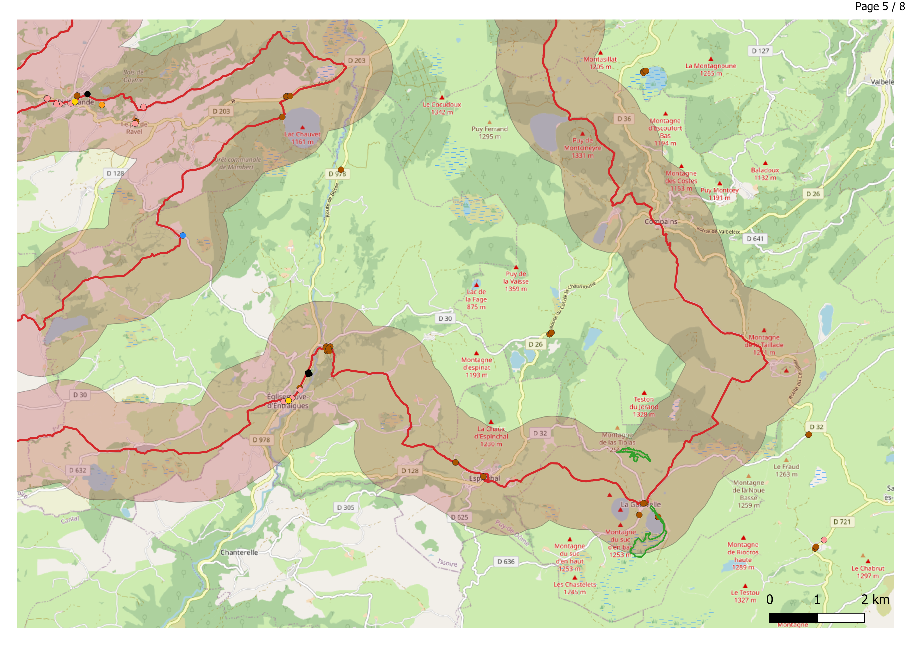
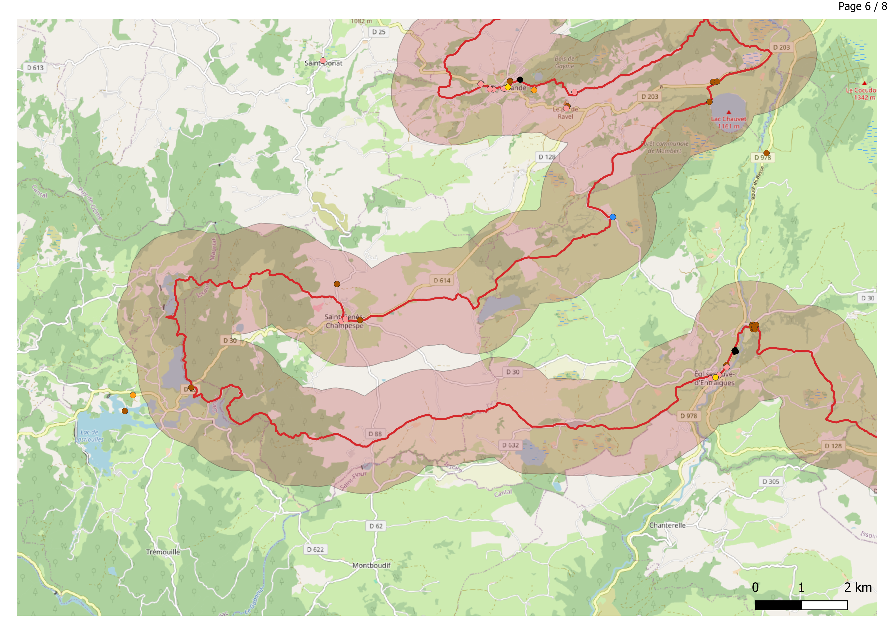
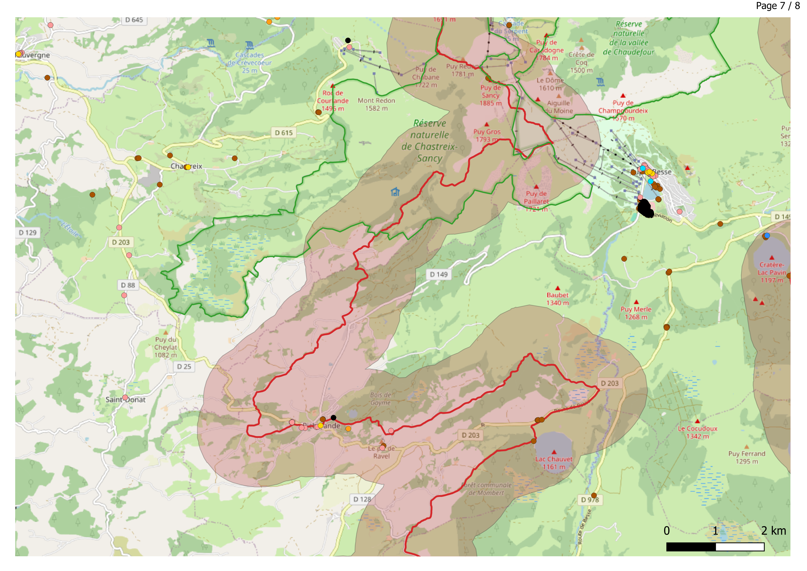
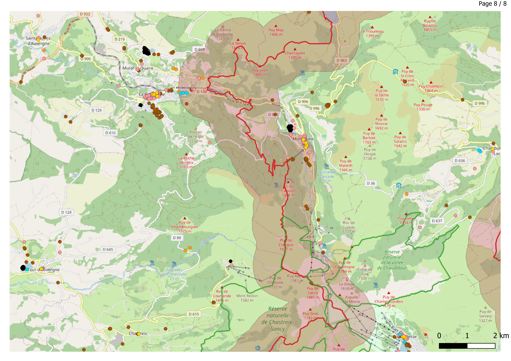

# GR30 - Trek 2026

Réalisation d'un projet cartographique / SIG avant de marcher le GR30.

## Outils utilisés

## Méthodologie

	- Récupération de la trace du GR30
	- Création d'une zone tampon autour de cette trace : 1Km
	- À l'aide du plugin QuickOSM, récupération des points d'intérêt proches du GR :
		- Boulangeries
		- Points d'eau
		- Douches
		- Aires de picnic
		- Aires de camping / Campings
		- Supermarchés
		- Réserves naturelles
	- Création d'un Atlas de 8 cartes
	- Recouper ces informations avec les informations du Massif du Sancy ()

## Fichiers

	'Atlas/Atlas GR30_*.png' - 8 pages de l'Atlas
	'GR30.qgz' - Projet QGIS autour du GR30
	'GR30.qgz' - Atlas du projet autour du GR30, 8 pages
	*Les fichiers *.shp répertoriant les données représentées sont absent du dépôt github.*

## Source des données

	- Fond de carte openStreetMap
	- Informations sur le massif du Sancy : https://www.sancy.com/voir-faire/balades-et-randonnees/la-rando-itinerante/gr30-tour-des-lacs-d-auvergne/
	- Données sur le GR30 : https://gr-go.fr/grande-randonnee/gr30-tour-des-lacs-d-auvergne/
	
## Atlas du GR30

	- *La légende est dans l'aperçu global. Désolé si ce n'est pas pratique*
	
	
	
	
	
	
	
	
	
	
	
	> *Penser à la Carte IGN Top 75 Chaîne des Puys et Massif du Sancy pour la rando en Auvergne*
	
	