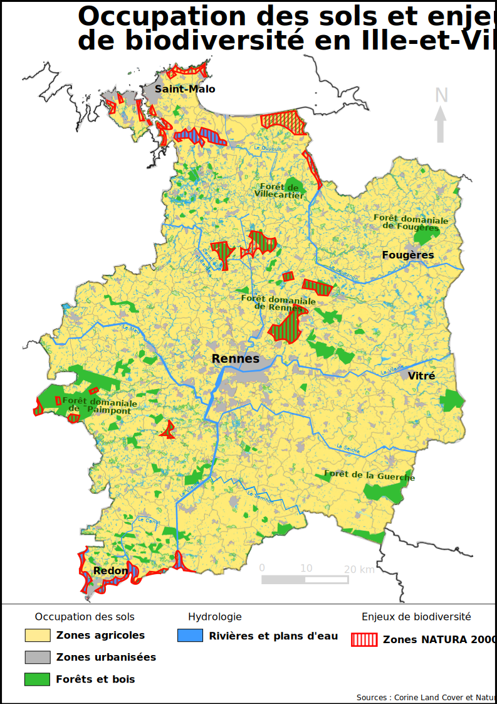

# Occupation du sol en Ille-et-Vilaine

Carte représentant l'occupation du sol et les principaux enjeux environnementaux
dans le département d'Ille-et-Vilaine (35), réalisée comme projet de validation du
[MOOC Cartographie](https://www.coursera.org/learn/cartographie) (Coursera).

Les données représentées :
- Zones urbaines
- Cours d'eau et principaux plans d'eau
- Bois et forêts
- Zones Natura 2000

## Fichiers

- `Biodiversité_en_Ille_et_Vilaine.svg` — version vectorielle, modifiable sous Inkscape
- `Biodiversité_en_Ille_et_Vilaine.pdf` — version imprimable
- `biodiversité35.qgz` - projet QGIS

> Les couches sources (fichiers `.shp` ne sont pas versionnées en raison de leurs tailles.
> Voir les sources ci-dessous pour les télécharger.

## Sources de données

- Occupation du sol | Corine Land Cover | (https://www.data.gouv.fr)
- Zones Natura 2000 | Géocatalogue | (https://www.geocatalogue.fr)
- Limites départementales / communales | (https://geoservices.ign.fr)
- Zones humides | (https://www.data.gouv.fr)

## Outils

QGIS · Inkscape

## Licence

[CC BY 4.0](https://creativecommons.org/licenses/by/4.0/) — libre de réutiliser avec attribution.
